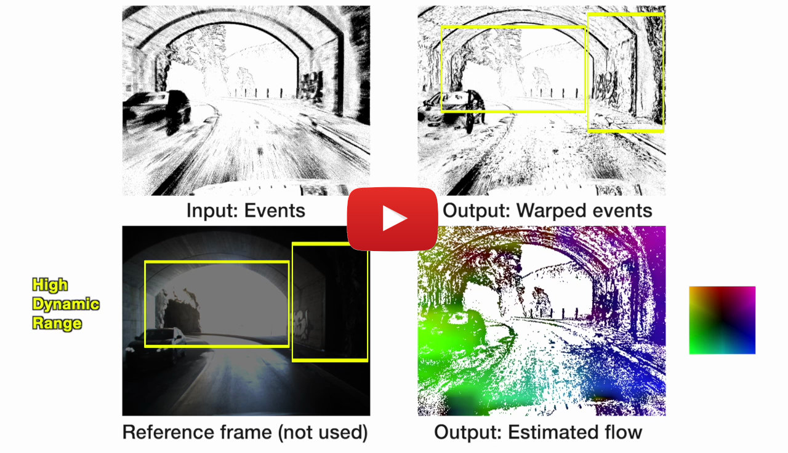

👀 **The extension paper has been accepted to IEEE T-PAMI! ([Paper](https://ieeexplore.ieee.org/document/10517639))**

👀 **We are now working to make this method more generic, easy-to-use functions (`flow = useful_function(events)`). Stay tuned!**

# Secrets of Event-Based Optical Flow (T-PAMI 2024, ECCV 2022)

This is the official repository for [**Secrets of Event-Based Optical Flow**](https://arxiv.org/abs/2207.10022), **ECCV 2022 Oral** by  
[Shintaro Shiba](http://shibashintaro.com/), [Yoshimitsu Aoki](https://aoki-medialab.jp/aokiyoshimitsu-en/) and [Guillermo Callego](https://sites.google.com/view/guillermogallego).

We have extended this paper to a journal version: [**Secrets of Event-based Optical Flow, Depth and Ego-motion Estimation by Contrast Maximization**](https://ieeexplore.ieee.org/document/10517639), **IEEE T-PAMI 2024**.

 <!-- - [Paper]() 
[[Video](https://youtu.be/nUb2ZRPdbWk)] [[PDF](https://link.springer.com/chapter/10.1007/978-3-031-19797-0_36)]
 [[arXiv](https://arxiv.org/pdf/2207.10022)]
 -->

<h2 align="left">
  
[Paper (IEEE T-PAMI 2024)](https://ieeexplore.ieee.org/document/10517639) | [Paper (ECCV 2022)](https://arxiv.org/pdf/2207.10022) | [Video](https://youtu.be/nUb2ZRPdbWk)
</h2>

[](https://youtu.be/nUb2ZRPdbWk)


If you use this work in your research, please cite it (see also [here](#citation)):

```bibtex
@Article{Shiba24pami,
  author        = {Shintaro Shiba and Yannick Klose and Yoshimitsu Aoki and Guillermo Gallego},
  title         = {Secrets of Event-based Optical Flow, Depth, and Ego-Motion by Contrast Maximization},
  journal       = {IEEE Trans. Pattern Anal. Mach. Intell. (T-PAMI)},
  year          = 2024,
  pages         = {1--18},
  doi           = {10.1109/TPAMI.2024.3396116}
}

@InProceedings{Shiba22eccv,
  author        = {Shintaro Shiba and Yoshimitsu Aoki and Guillermo Gallego},
  title         = {Secrets of Event-based Optical Flow},
  booktitle     = {European Conference on Computer Vision (ECCV)},
  pages         = {628--645},
  doi           = {10.1007/978-3-031-19797-0_36},
  year          = 2022
}
```

## **List of datasets that the flow estimation is tested on**

Although this codebase releases just MVSEC examples,
I have tested the flow estimation is roughly good in the below datasets.
The list is being updated, and if you test new datasets please let us know.

- [MVSEC](https://daniilidis-group.github.io/mvsec/)
- [DSEC](https://dsec.ifi.uzh.ch/dsec-datasets/download/)
- [ECD, both simulation and real data](http://rpg.ifi.uzh.ch/davis_data.html)
- [TUM VIE](https://cvg.cit.tum.de/data/datasets/visual-inertial-event-dataset)
- [UZH-FPV Drone Racing Dataset](https://fpv.ifi.uzh.ch/)
- [EDS](https://rpg.ifi.uzh.ch/eds.html#dataset)
- [M3ED](https://m3ed.io/)

The above is all public datasets, and in our paper (T-PAMI 2024) we also used some non-public dataset from previous works.

-------
# Setup

## Requirements

Although not all versions are strictly tested, the followings should work.

- python: 3.8.x, 3.9.x, 3.10.x

GPU is entirely optional.
If `torch.cuda.is_available()` then it automatically switches to use GPU.
I'd recomment to use GPU for time-aware solutions, but CPU is ok for no-timeaware method as long as I tested.

### Tested environments

- Mac OS Monterey (both M1 and non-M1)
- Ubuntu (CUDA 11.1, 11.3, 11.8)
- PyTorch 1.9-1.12.1, or PyTorch 2.0 (1.13 raises an error during Burgers).

## Installation

I strongly recommend to use venv: `python3 -m venv <new_venv_path>`
Also, you can use [poetry]().

- Install pytorch **< 1.13** or **>= 2.0** and torchvision for your environment. Make sure you install the correct CUDA version if you want to use it.

- If you use poetry, `poetry install`. If you use only venv, check dependecy libraries and install it from [here](./pyproject.toml).

- If you are having trouble to install pytorch with cuda using poetry refer to this [link](https://github.com/python-poetry/poetry/issues/6409). 

## Download dataset

Download each dataset under `./datasets` directory.
Optionally you can specify other root directory:
please check the [dataset readme](./datasets/README.md) for the details.

# Execution

```shell
python3 main.py --config_file ./configs/mvsec_indoor_no_timeaware.yaml
```

If you use poetry, simply add `poetry run` at the beginning.
Please run with `-h` option to know more about the other options.

## Config file

The config (.yaml) file specifies various experimental settings.
Please check and change parameters as you like.

### Optional tasks (for me)

**The code here is already runnable, and explains the ideas of the paper enough.** (Please report bugs if any.)

Rather than releasing all of my (sometimes too experimental) codes,
I published just a minimal set of the codebase to reproduce.
So the following tasks are more optional for me.
But if it helps you, I can publish other parts as well. For example:

 - Other data loader

 - Some other cost functions

 - Pretrained model checkpoint file ✔️ [released for MVSEC](https://drive.google.com/file/d/13m-waAt5X0C7f0JLBwb6KAApYxgXoA2J/view?usp=sharing)

 - Other solver (especially DNN)

 - The implementation of [the Sensors paper]((https://www.mdpi.com/1424-8220/22/14/5190))

Your feedback is helpful to prioritize the tasks, so please contact me or raise issues.
The code is modularized well, so if you want to contribute, it should be easy too.

# Citation

If you use this work in your research, please cite it **as stated above**, below the video.

This code also includes some implementation of the [following paper about event collapse in details](https://www.mdpi.com/1424-8220/22/14/5190).
Please check it :)

```bibtex
@Article{Shiba22sensors,
  author        = {Shintaro Shiba and Yoshimitsu Aoki and Guillermo Gallego},
  title         = {Event Collapse in Contrast Maximization Frameworks},
  journal       = {Sensors},
  year          = 2022,
  volume        = 22,
  number        = 14,
  pages         = {1--20},
  article-number= 5190,
  doi           = {10.3390/s22145190}
}
```

# Author

Shintaro Shiba [@shiba24](https://github.com/shiba24)

## LICENSE

Please check [License](./LICENSE).

## Acknowledgement

I appreciate the following repositories for the inspiration:

- [autograd-minimize](https://github.com/brunorigal/autograd-minimize)

-------
# Additional Resources

* [Event Collapse in Contrast Maximization Frameworks](https://github.com/tub-rip/event_collapse)
* [Research page (TU Berlin, RIP lab)](https://sites.google.com/view/guillermogallego/research/event-based-vision)
* [Research page (Keio University, Aoki Media Lab)](https://aoki-medialab.jp/home-en/)
* [Course at TU Berlin](https://sites.google.com/view/guillermogallego/teaching/event-based-robot-vision)
* [Survey paper](http://rpg.ifi.uzh.ch/docs/EventVisionSurvey.pdf)
* [List of Resources](https://github.com/uzh-rpg/event-based_vision_resources)
